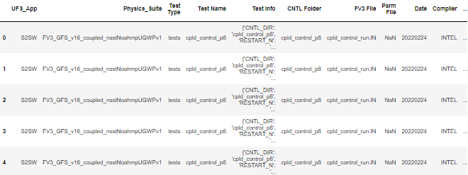
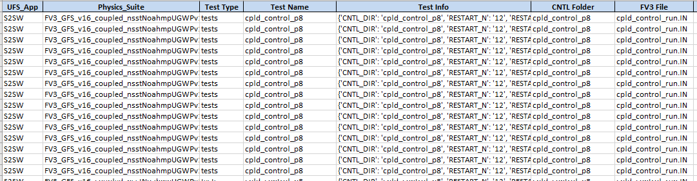
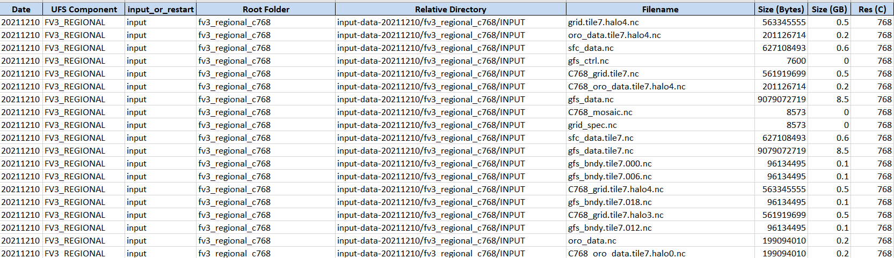
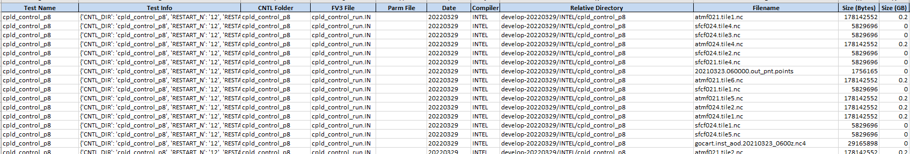

<h1 align="center">
Mapping UFS Applications to UFS-WM Regression Test Dataset Files
</h1>

    
    
    
    

<h5 align="center">
    
[Prerequisites](#Prerequisites) • [Dataset](#Dataset) • [Quick Start](#Quick-Start) • [Environment Setup](#Environment-Setup) • [Status](#Status)
 • [What's Included](#What's-Included) • [Documentation](#Documentation) • [References](#Reference(s))

</h5>

# About

__Introduction:__

There is a need for developers/users using the UFS Weather Model to be able to determine what data is required for a given UFS Weather Model Application-to-Physics Suite build as well as for a given unique UFS weather model application's regression test. Currently, a reference table does not exist for which will map the UFS Application-to-Physics Suite to their corresponding required list of data files nor a reference table for which will map the UFS weather model application's regression tests to their required list of data files. According to the current structure of the UFS weather model framework, the details are hidden within it's regression test framework scripts -- in which each unique regression test (listed within the regression test framework's rt.conf script) is represented by a unique "test" script (within ufs-weather-model repo's /tests/tests). Each unique "test" script will then call unique configuration files residing within the following ufs-weather-model repo's folders:

* /fv3_conf
* /parm file
Note: Each unique regression test can only be applicable to a unique UFS Weather Model Application build.

__Purpose:__

The purpose of the tool is to extract additional information regarding the input and baseline datasets residing within the RDHPCS relationship to the UFS Weather Model Application-to-Physics Suite & their corresponding set of regression tests -- in an effort to provide developers/users a mapping of the data files required for a given UFS Application-to-Physics Suite build as well as for a UFS application's given unique regression test.

In this demontration, the tool will be applied against the UFS input and baseline datasets residing within the RDHPC platform, Orion.

__Capabilities:__

This tool will be able to perform the following actions:

* Apply feature engineering to obtain additional information regarding the data files.
* Extract all data filenames mapping them to their corresponding relative directory path, root folder, filename, filesize, file format, compiler (if applicable), CNTL folder (if applicable), "input" or "restart" file type, resolution (km) category, resolution (C resolution) category.
* Categorize & sort each data file into a given UFS Weather Model Application-to-Physics Suite build & Regression Tests.
* Generate reference table/map of each data files to UFS Weather Model Application-to-Physics Suite & Regression Tests
* Generates map to distinguish between the configuration files & test parameters required for a given UFS application-to-physics suite build’s regression test.

__Future Capabilities:__

This tool can be used as a skeleton framework for querying information regarding the data files as they pertain to a unique UFS Weather Model Application-to-Physics Suite build &/or Regression Test.

# Table of Contents
* [Prerequisites](#Prerequisites)
* [Dataset](#Dataset)
* [Quick Start](#Quick-Start)
* [Environment Setup](#Environment-Setup)
* [Status](#Status)
* [What's Included](#What's-Included)
* [Documentation](#Documentation)
* [References](#Creator(s))

# Prerequisites
* Python 3.9

# Dataset
* ufs_baseline&input_dataframes/baseline_df.pkl (Map of UFS baseline data to UFS Component)
* ufs_baseline&input_dataframes/input_df.pkl  (Map of UFS input data to UFS Component)

# Quick Start
* For demonstration purposes, refer to 'categorizing-input-data-by-test-scripts-demo.ipynb' & 'map-appbuild2baseline-scripts-demo.ipynb'

# Environment Setup

* Install miniconda on your machine. Note: Miniconda is a smaller version of Anaconda that only includes conda along with a small set of necessary and useful packages. With Miniconda, you can install only what you need, without all the extra packages that Anaconda comes packaged with:
Download latest Miniconda (e.g. 3.9 version):

    * wget https://repo.anaconda.com/miniconda/Miniconda3-py39_4.9.2-Linux-x86_64.sh

* Check integrity downloaded file with SHA-256:

    * sha256sum Miniconda3-py39_4.9.2-Linux-x86_64.sh

Reference SHA256 hash in following link: https://docs.conda.io/en/latest/miniconda.html

* Install Miniconda in Linux:

    * bash Miniconda3-py39_4.9.2-Linux-x86_64.sh

* Next, Miniconda installer will prompt where do you want to install Miniconda. Press ENTER to accept the default install location i.e. your $HOME directory. If you don't want to install in the default location, press CTRL+C to cancel the installation or mention an alternate installation directory. If you've chosen the default location, the installer will display “PREFIX=/var/home//miniconda3” and continue the installation.

* For installation to take into effect, run the following command:

source ~/.bashrc

* Next, you will see the prefix (base) in front of your terminal/shell prompt. Indicating the conda's base environment is activated. Once you have conda installed on your machine, perform the following to create a conda environment:

    * To create a new environment (if a YAML file is not provided)

        * conda create -n [Name of your conda environment you wish to create]

(OR)

    * To ensure you are running Python 3.9:

        * conda create -n myenv Python=3.9

(OR)

* To create a new environment from an existing YAML file (if a YAML file is provided):

    * conda env create -f environment.yml

*Note: A .yml file is a text file that contains a list of dependencies, which channels a list for installing dependencies for the given conda environment. For the code to utilize the dependencies, you will need to be in the directory where the environment.yml file lives.

## Activate the new environment via:

conda activate [Name of your conda environment you wish to activate]

* Verify that the new environment was installed correctly via:

    * conda info --env

*Note:

* From this point on, must activate conda environment prior to .py script(s) or jupyter notebooks execution using the following command: conda activate
    * To deactivate a conda environment:
        * conda deactivate

## Link Home Directory to Dataset Location on RDHPCS Platform

* Unfortunately, there is no way to navigate to the "/work/" filesystem from within the Jupyter interface when working on the remote server, Orion. The best way to workaround is to create a symbolic link in your home folder that will take you to the /work/ filesystem. Run the following command from a linux terminal on Orion to create the link:

    * ln -s /work /home/[Your user account name]/work

* Now, when you navigate to the /home/[Your user account name]/work directory in Jupyter, it will take you to the /work folder. Allowing you to obtain any data residing within the /work filesystem that you have permission to access from Jupyter. This same procedure will work for any filesystem available from the root directory.

*Note: On Orion, user must sym link from their home directory to the main directory containing the datasets of interest.

## Open & Run Application on Jupyter Notebook

* Open OnDemand has a built-in file explorer and file transfer application available directly from its dashboard via:

    * Login to https://orion-ood.hpc.msstate.edu/

* In the Open OnDemand Interface, select Interactive Apps > Jupyter Notbook

## Additonal Information

To create a .yml file, execute the following commands:

* Activate the environment to export:

    * conda activate myenv

* Export your active environment to a new file:

    * conda env export > [ENVIRONMENT FILENAME].yml

# Status

# What's Included
Within the download, you will find the following directories and files:
    > app2bl_mapper.py
    > script_scraper.py
    > categorizing-input-data-by-test-scripts-demo.ipynb
    > map-appbuild2baseline-scripts-demo.ipynb
    > data_scraper_env.yml
    > Latest_UFSApp2BaselineMap_20220329.xlsx (ufs-app2rtdata-map)
        * Output from mapping tool: Generated UFS App-to-Physics Suite build to baseline data files map.
    > Latest_UFSComponent2InputMap_20211210.xlsx (ufs-conp2files-map)
        * Output from mapping tool: Generated UFS Component-to-UFS data files map. Also, maps the configuration files and test parameters required for each unique UFS regression test.

* UFS App Mapping Tool:
    > app2bl_mapper.py
        * Demo: map-appbuild2baseline-scripts-demo.ipynb
    > categorizing-input-data-by-test-scripts-demo.ipynb
    
* List of Dependencies: 
    > data_scraper_env.yml

# Documentation

# References
N/A
